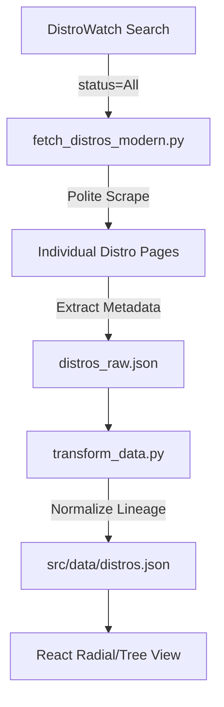

# DistroWatch Scraper Engine

A modernized Python-based scraping engine designed to fetch, process, and transform Linux distribution data from DistroWatch.com for high-performance visualizations.

## 🌟 Key Features

- **Full Ecosystem Coverage**: Fetches all **1,100+** distributions (Active, Discontinued, and Dormant) using specialized search parameters (`status=All`).
- **Data Repair Mode**: Intelligent `--repair` flag that identifies incomplete records (missing logos or popularity hits) and re-fetches only those entries.
- **Rich Metadata Extraction**:
  - **Logos**: Direct absolute URLs from DistroWatch CDN.
  - **Popularity**: Historical page hit rankings.
  - **Lineage**: Automated parent/child relationship normalization.
  - **Attributes**: Description, Country of Origin, Architecture, Desktop Environments, and Category.
- **Robust Pipeline**: 
  - **Anti-Bot Resilience**: Randomized headers and jittered delays to avoid IP blocks.
  - **Caching Layer**: Persists raw HTML responses to `distrowatch_cache.json` for instant subsequent runs.
  - **Transformation Engine**: Converts raw DistroWatch tables into optimized JSON for React/D3.

## 🏗️ Architecture



## 🚀 Quick Start

### 1. Installation
```bash
pip install -r requirements.txt
```

### 2. Automated Update (Recommended)
This script handles the full fetch-and-transform pipeline.
```bash
# Standard update using cache
./update_distros.sh --use-cache

# Comprehensive repair for missing data
./update_distros.sh --use-cache --repair
```

### 3. Manual Commands
**Fetch raw data:**
```bash
python3 fetch_distros_modern.py --output distros_raw.json --delay 1.0
```

**Transform for React:**
```bash
python3 transform_data.py --input distros_raw.json --output ../src/data/distros.json --merge
```

## 🛠️ Repair Mode Detail

The `--repair` argument is a crucial feature added to handle network instability. If a fetch fails or DistroWatch closes a connection mid-scrape, simply run with `--repair`. The scraper will:
1. Load `distrowatch_cache.json`.
2. Find any entry where `popularity` or `logo` is null.
3. Re-queue only those specific entries for a fresh fetch.

## 📄 File Manifest

| File | Purpose |
|------|---------|
| `fetch_distros_modern.py` | The main crawler engine with retry/repair logic. |
| `transform_data.py` | Data normalization and React-format conversion. |
| `update_distros.sh` | Wrapper script for the full pipeline. |
| `requirements.txt` | Minimal dependencies (BeautifulSoup4, Requests). |

## 📜 Legal & Ethics
This scraper includes performance-limiting delays and is intended for non-commercial educational use in visualizing Linux history. Please respect DistroWatch's `robots.txt` and server load.
